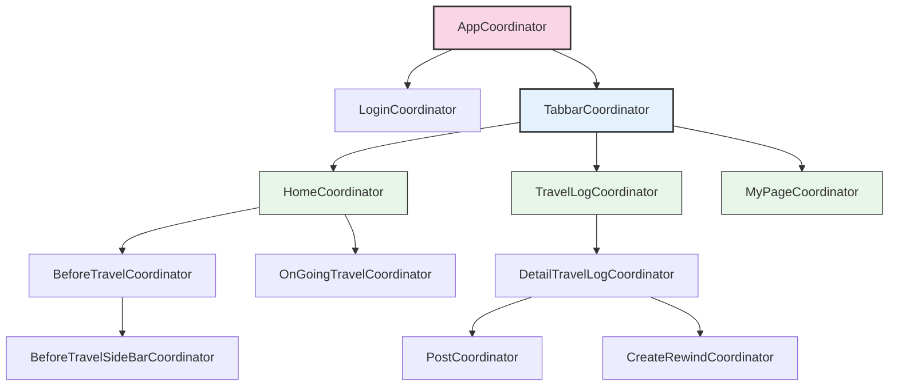

# WithYou 앱의 Coordinator 패턴 가이드

## Coordinator 패턴이란?
Coordinator 패턴은 화면 전환 및 앱의 흐름을 관리하기 위한 디자인 패턴입니다. 이 패턴을 사용하면 각 화면(ViewController)에서 화면 전환 로직을 분리하여 ViewController를 더 독립적이고 재사용 가능하게 만들 수 있습니다. WithYou 앱에서는 이 패턴을 활용하여 화면 간 이동과 의존성 주입을 효과적으로 관리하고 있습니다.

## Coordinator 구조

### 기본 프로토콜
WithYou 앱의 모든 Coordinator는 `Coordinator` 프로토콜을 구현합니다:

```swift
public protocol Coordinator: AnyObject {
    var childCoordinators: [Coordinator] { get set }
    var parentCoordiantor: Coordinator? { get set }
    func start()
}

extension Coordinator {
    public func childDidFinish(_ child: Coordinator?) {
        for (index, coordinator) in childCoordinators.enumerated() where coordinator === child {
            childCoordinators.remove(at: index)
            break
        }
    }
}
```

이 프로토콜은 다음 요소로 구성됩니다:
- `childCoordinators`: 하위 Coordinator들을 관리하는 배열
- `parentCoordiantor`: 상위 Coordinator에 대한 참조
- `start()`: Coordinator의 시작점 (화면 생성 및 표시)
- `childDidFinish()`: 하위 Coordinator가 종료될 때 정리하는 메서드

### Coordinator 계층 구조
WithYou 앱의 Coordinator 계층 구조는 다음과 같습니다:



1. **AppCoordinator** - 최상위 Coordinator
   - **LoginCoordinator** - 로그인 및 온보딩 화면 관리
   - **TabbarCoordinator** - 탭바 기반 메인 화면 관리
     - **HomeCoordinator** - 홈 탭 관리
       - **BeforeTravelCoordinator** - 여행 전 화면 관리
         - **BeforeTravelSideBarCoordinator** - 여행 전 사이드바 관리
       - **OnGoingTravelCoordinator** - 진행 중인 여행 화면 관리
     - **TravelLogCoordinator** - 여행 로그 탭 관리
       - **DetailTravelLogCoordinator** - 여행 로그 상세 화면 관리
         - **PostCoordinator** - 포스트 관련 화면 관리
         - **CreateRewindCoordinator** - 리와인드 생성 화면 관리
     - **MyPageCoordinator** - 마이페이지 탭 관리

## Coordinator 사용 방법

### 1. Coordinator 정의하기
새로운 기능을 추가할 때 해당 기능의 화면 흐름을 관리할 Coordinator를 다음과 같이 정의합니다:

```swift
public final class MyFeatureCoordinator: Coordinator {
    
    // 필수 프로퍼티
    public var childCoordinators: [Coordinator] = []
    public var parentCoordiantor: Coordinator?
    
    // 해당 Coordinator에서 사용할 NavigationController
    private var navigationController: UINavigationController
    
    // 필요한 경우 관리할 ViewController 참조
    private var myFeatureViewController: MyFeatureViewController?
    
    // 의존성 주입 (생성자를 통해)
    public init(navigationController: UINavigationController) {
        self.navigationController = navigationController
    }
    
    // Coordinator 시작점
    public func start() {
        // DIContainer를 통해 필요한 UseCase 가져오기
        let useCase = DIContainer.shared.resolve(MyFeatureUseCase.self)!
        
        // ViewModel 생성 및 의존성 주입
        let viewModel = MyFeatureViewModel(useCase: useCase)
        
        // ViewController 생성 및 Coordinator 참조 설정
        let viewController = MyFeatureViewController(viewModel: viewModel)
        viewController.coordinator = self
        
        // 화면 표시
        navigationController.pushViewController(viewController, animated: true)
        self.myFeatureViewController = viewController
    }
}
```

### 2. Coordinator 간 통신을 위한 Protocol 정의하기
ViewController와 Coordinator 간의 통신을 위해 델리게이트 패턴을 사용합니다:
- APP의 화면 전환은 모두 Coordinator에서 관리합니다.
- ViewController는 Coordinator에게 이벤트를 전달하고, Coordinator는 이벤트를 처리하여 화면 전환을 수행합니다.

```swift
// ViewController에서 Coordinator로의 이벤트 전달을 위한 프로토콜
public protocol MyFeatureViewControllerDelegate {
    func navigateToDetailScreen(data: MyData)
    func dismissScreen()
}

// Coordinator에서 프로토콜 구현
extension MyFeatureCoordinator: MyFeatureViewControllerDelegate {
    public func navigateToDetailScreen(data: MyData) {
        let detailCoordinator = DetailCoordinator(navigationController: navigationController, data: data)
        detailCoordinator.parentCoordiantor = self
        childCoordinators.append(detailCoordinator)
        detailCoordinator.start()
    }
    
    public func dismissScreen() {
        parentCoordiantor?.childDidFinish(self)
        navigationController.popViewController(animated: true)
    }
}
```

### 3. ViewController에서 Coordinator 사용하기

```swift
public class MyFeatureViewController: BaseViewController {
    
    // Coordinator 참조 (weak로 선언하여 순환 참조 방지)
    public weak var coordinator: MyFeatureViewControllerDelegate?
    
    private let viewModel: MyFeatureViewModel
    
    public init(viewModel: MyFeatureViewModel) {
        self.viewModel = viewModel
        super.init()
    }
    
    // Coordinator로 이벤트 전달 예시
    private func handleItemSelected(data: MyData) {
        coordinator?.navigateToDetailScreen(data: data)
    }
    
    private func handleBackButtonTapped() {
        coordinator?.dismissScreen()
    }
}
```

### 4. 부모 Coordinator에서 자식 Coordinator 관리하기

```swift
public class ParentCoordinator: Coordinator {
    // ... 기본 속성들 ...
    
    public func startChildFeature() {
        let childCoordinator = MyFeatureCoordinator(navigationController: navigationController)
        childCoordinator.parentCoordiantor = self
        childCoordinators.append(childCoordinator)
        childCoordinator.start()
    }
}
```

## Coordinator와 DIContainer 활용

WithYou 앱에서는 Coordinator 패턴과 DIContainer를 함께 활용하여 의존성 주입과 화면 전환을 효과적으로 관리합니다:

```swift
public func start() {
    // DIContainer를 통해 UseCase 가져오기
    let useCase = DIContainer.shared.resolve(MyFeatureUseCase.self)!
    
    // ViewModel 생성 및 의존성 주입
    let viewModel = MyFeatureViewModel(useCase: useCase)
    
    // ViewController 생성 및 Coordinator 참조 설정
    let viewController = MyFeatureViewController(viewModel: viewModel)
    viewController.coordinator = self
    
    // 화면 표시
    navigationController.pushViewController(viewController, animated: true)
}
```

## 주요 Coordinator 예제

### 1. AppCoordinator
앱의 최상위 Coordinator로, 로그인 상태에 따라 로그인 또는 메인 화면으로 분기처리합니다:

```swift
func start() {
    if UserDefaultsManager.isLoggined {
        startTabbarScene()
    } else {
        startLoginScene()
    }
}
```

### 2. TabbarCoordinator
앱의 메인 화면을 탭바로 구성하고 각 탭에 해당하는 Coordinator를 생성합니다:

```swift
public func start() {
    let pages = TabbarPage.allCases
    let controllers: [UINavigationController] = pages.map {
        self.createTabNavigationController(page: $0)
    }
    self.configureTabbarController(with: controllers)
}
```

## Coordinator 패턴의 장점

1. **관심사 분리**: 화면 전환 로직을 ViewController에서 분리하여 각 컴포넌트의 책임을 명확히 합니다.
2. **재사용성 향상**: ViewController가 화면 전환에 독립적이므로 다른 흐름에서도 재사용 가능합니다.
3. **테스트 용이성**: 화면 전환 로직을 Mock Coordinator로 대체하여 테스트할 수 있습니다.
4. **유연한 화면 흐름 관리**: 새로운 화면 흐름이 필요할 때 기존 코드 수정 없이 새 Coordinator를 추가할 수 있습니다.
5. **앱 구조의 명확성**: 앱의 화면 구조와 흐름을 Coordinator 계층 구조를 통해 명확하게 파악할 수 있습니다.

## 주의사항

1. **메모리 관리**: 부모-자식 Coordinator 간 강한 참조로 인한 메모리 누수에 주의해야 합니다. `childDidFinish` 메서드를 통해 자식 Coordinator를 적절히 제거해야 합니다.
2. **복잡성 관리**: Coordinator가 너무 많아지면 오히려 복잡성이 증가할 수 있으므로, 적절한 수준에서 Coordinator를 설계해야 합니다.
3. **의존성 주입**: Coordinator를 통해 ViewController에 필요한 모든 의존성을 주입해야 합니다.

## 결론

Coordinator 패턴은 WithYou 앱의 화면 전환 및 흐름 관리를 체계적으로 구조화하여, 유지보수성과 확장성을 높이는 핵심 패턴입니다. 새로운 기능을 추가할 때는 이 가이드를 참고하여 Coordinator 패턴을 일관되게 적용하는 것이 중요합니다.
